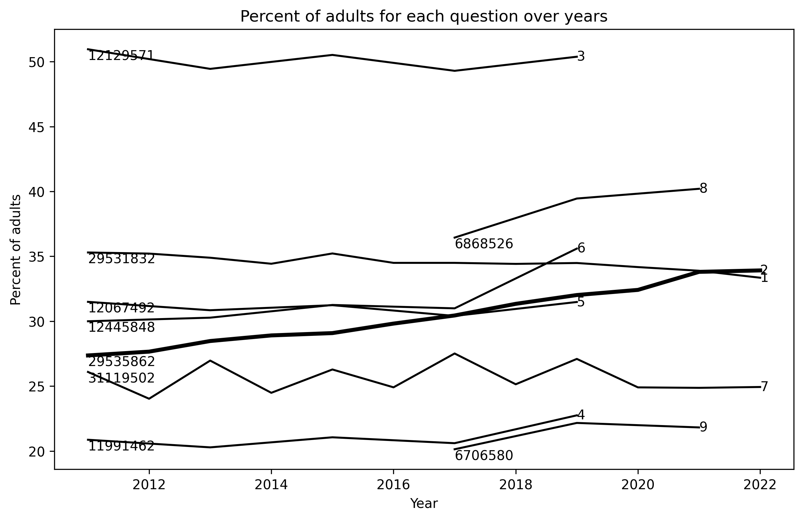

# obesity

$ pyhton obesity.py

In each line, left number represents the number of participants while right number indicates question number.
The thick solid line labeled "2" represents adult obesity rate.

<pre>
Nine questions:
1: Percent of adults aged 18 years and older who have an overweight classification
2: Percent of adults aged 18 years and older who have obesity
3: Percent of adults who achieve at least 150 minutes a week of moderate-intensity aerobic physical activity or 75 minutes a week of vigorous-intensity aerobic activity (or an equivalent combination)
4: Percent of adults who achieve at least 150 minutes a week of moderate-intensity aerobic physical activity or 75 minutes a week of vigorous-intensity aerobic physical activity and engage in muscle-strengthening activities on 2 or more days a week
5: Percent of adults who achieve at least 300 minutes a week of moderate-intensity aerobic physical activity or 150 minutes a week of vigorous-intensity aerobic activity (or an equivalent combination)
6: Percent of adults who engage in muscle-strengthening activities on 2 or more days a week
7: Percent of adults who engage in no leisure-time physical activity  
8: Percent of adults who report consuming fruit less than one time daily
9: Percent of adults who report consuming vegetables less than one time daily

</pre>

